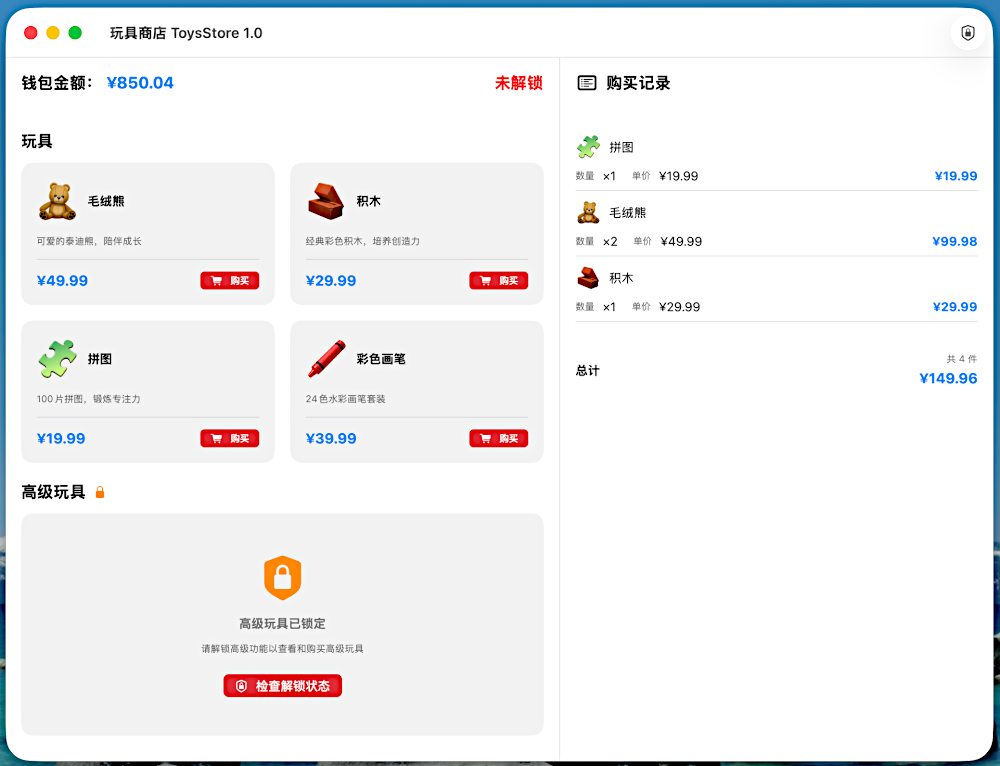

# 🧸 ToysStore

[中文文档](README_CN.md) | English

A macOS toy store demo application built with SwiftUI and SwiftData. This project is designed for **Frida dynamic instrumentation demonstration**.

## ✨ Features

- 🛒 Browse and purchase toys
- 💰 Wallet system with balance management
- 🔐 Premium toys unlock mechanism
- 📋 Purchase history tracking
- 🎨 Modern SwiftUI interface with HSplitView layout

## 🛠 Tech Stack

- **UI Framework**: SwiftUI
- **Data Framework**: SwiftData
- **Language**: Swift 6+ (Pure Swift, no Objective-C)
- **Platform**: macOS 14.0+
- **IDE**: Xcode 15+

## 📁 Project Structure

```
ToysStore/
├── ToysStoreApp.swift          # App entry point
├── Models/
│   ├── Toy.swift               # Toy data model
│   ├── Wallet.swift            # Wallet data model
│   ├── Purchase.swift          # Purchase record & manager
│   ├── Store.swift             # Store status manager
│   └── PremiumManager.swift    # Premium unlock manager
├── Views/
│   ├── MainContentView.swift   # Main split view
│   ├── ToyRowView.swift        # Toy card component
│   ├── WalletBarView.swift     # Wallet status bar
│   ├── PurchaseListView.swift  # Purchase history list
│   └── LockedMessageView.swift # Locked state message
└── Utilities/
    ├── Formatters.swift        # Currency & date formatters
    ├── PreviewData.swift       # Preview test data
    └── AppIconGenerator.swift  # Runtime app icon generator
```

## 🚀 Getting Started

### Requirements

- macOS 14.0 or later
- Xcode 15.0 or later

### Build & Run

1. Clone the repository
2. Open `ToysStore.xcodeproj` in Xcode
3. Select your target device (Mac)
4. Press `Cmd + R` to build and run

## 🔬 Architecture Overview

This app is designed for Frida dynamic instrumentation demonstrations. Key hook targets:
### Core Components

**PremiumManager** - Core unlock state management:
```swift
@MainActor
final class PremiumManager {
    static let shared = PremiumManager()
    
    func isCoreUnlocked() -> Bool {
        true  // Core unlock logic
    }
}
```

**Store** - Store status management with enum-based state:
```swift
@MainActor
final class Store {
    static let shared = Store()
    
    func storeStatus() -> StoreStatus {
        PremiumManager.shared.isCoreUnlocked() ? .unlocked : .locked
    }
}

enum StoreStatus {
    case locked
    case unlocked
}
```

## 📝 Notes

- **Pure Swift Implementation**: Built entirely with Swift 6+, no Objective-C dependencies
- **In-Memory Storage**: Data is stored in memory only (`isStoredInMemoryOnly: true`) - resets on app restart
- **Initial Wallet Balance**: ¥1,000.00
- **Premium Unlock**: Premium toys require unlock (controlled by `PremiumManager.isCoreUnlocked()`)
- **App Icon**: Dynamically generated at runtime using emoji (🧸)

## 📸 Screenshot




## 📄 License

This project is for educational and demonstration purposes.
